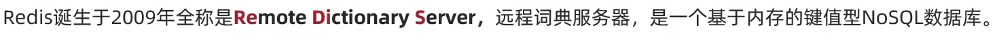
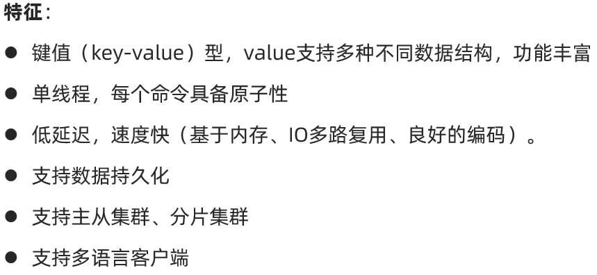
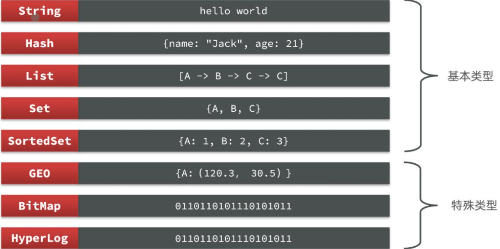
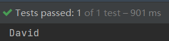

# Redis基础

## 1. 认识NoSQL

SQL (关系型数据库) 和 NoSQL (非关系型数据库) 的区别：

1. 结构化和非结构化：

S --> 结构化（约束条件） 体现在数据库中各种各样的表结构

NoS --> 非结构化  如Redis里的键值对形式，MongoDB的文档类型等

1. 关系型和非关系型

关系型数据库中表与表间一般存在关联关系，非关系型数据库中则不存在

1. SQL语句

关系型中 （以msql为例）有着语法固定的CRUD语句，可以适用于各类诸如Mysql，Oracle等

```java
SELECT * FROM T_USER
```

非关系型中 语法不固定 如redis中的查询语句

```java
get user::1
```

和MongoDB中的查询

```java
db.users.find({_id: 1})
```

亦或是ElasticSearch中的查询

```java
GET http://localhost:9001/users/1
```

1. 事务的差距

关系型数据库一般数据间满足事务属性：ACID

非关系型数据库有的不支持事务机制

1. 存储方式的差距

关系型数据库一般存储在磁盘，非关系型数据库一般存储在内存

## 2. 认识Redis



Redis的特征：



## 3. Redis常用指令

Redis是典型的key-value数据库，key一般是字符串，而value包含很多不同的数据类型



### 3.1. Redis通用指令

常用的通用命令有以下几个

| 命令         | 描述                                                     |
| ------------ | -------------------------------------------------------- |
| KEYs pattern | 查找所有符合给定模式(pattern)的key                       |
| EXISTs key   | 检查给定key是否存在                                      |
| TYPE key     | 返回key所储存的值的类型                                  |
| TTL key      | 返回给定key的剩余生存时间(TTL, time to live)，以秒为单位 |
| DEL key      | 该命令用于在key存在是删除key                             |

- KEYS：查看符合模板的所有key

- - 不建议在生产环境设备上使用，因为Redis是单线程的，执行查询的时候会**阻塞**其他命令，当数据量很大的时候，使用KEYS进行模糊查询，效率很差

- DEL：删除一个指定的key

- - 也可以删除多个key，DEL name age，会将name和age都删掉

- EXISTS：判断key是否存在

- - EXISTS name，如果存在返回1，不存在返回0

- EXPIRE：给一个key设置有效期，有效期到期时该key会被自动删除

- - EXPIRE name 20，给name设置20秒有效期，到期自动删除

- TTL：查看一个key的剩余有效期(Time-To-Live)

- - TTL name，查看name的剩余有效期，如果未设置有效期，则返回-1

### 3.2. String类型

String类型，也就是字符串类型，是Redis中最简单的存储类型，其value是字符串，不过根据字符串的格式不同，又可以分为3类

- string：普通字符串
- int：整数类型，可以做自增、自减操作
- float：浮点类型，可以做自增、自减操作
  不管是哪种格式，底层都是字节数组形式存储，只不过是编码方式不同，字符串类型的最大空间不能超过512M

#### 3.2.1. String的常用命令

String的常用命令有

| 命令        | 描述                                                         |
| ----------- | ------------------------------------------------------------ |
| SET         | 添加或者修改一个已经存在的String类型的键值对                 |
| GET         | 根据key获取String类型的value                                 |
| MEST        | 批量添加多个String类型的键值对                               |
| MGET        | 根据多个key获取多个String类型的value                         |
| INCR        | 让一个整形的key自增1                                         |
| INCRBY      | 让一个整形的key自增并指定步长值，例如：incrby num 2，让num值自增2 |
| INCRBYFLOAT | 让一个浮点类型的数字自增并指定步长值                         |
| SETNX       | 添加一个String类型的键值对，前提是这个key不存在，否则不执行，可以理解为真正的新增 |
| SETEX       | 添加一个String类型的键值对，并指定有效期                     |

#### 3.2.2. Key结构

- Redis没有类似MySQL中Table的概念，那么我们该如何区分不同类型的Key呢？
- 例如：需要存储用户、商品信息到Redis，有一个用户的id是1，有一个商品的id恰好也是1，如果此时使用id作为key，那么就回冲突，该怎么办？
- 我们可以通过给key添加前缀加以区分，不过这个前缀不是随便加的，有一定的规范

- - Redis的key允许有多个单词形成层级结构，多个单词之间用:隔开，格式如下

```java
项目名:业务名:id
```

- - 这个格式也并非是固定的，可以根据自己的需求来删除/添加词条，这样我们就可以把不同数据类型的数据区分开了，从而避免了key的冲突问题
  - 例如我们的项目名叫reggie，有user和dish两种不同类型的数据，我们可以这样定义key

- - - user相关的key：reggie:user:1
    - dish相关的key：reggie:dish:1

- 如果value是一个Java对象，例如一个User对象，则可以将对象序列化为JSON字符串后存储

| KEY           | VALUE                                       |
| ------------- | ------------------------------------------- |
| reggie:user:1 | {“id”:1, “name”: “Jack”, “age”: 21}         |
| reggie:dish:1 | {“id”:1, “name”: “鲟鱼火锅”, “price”: 4999} |

- 并且在Redis的桌面客户端中，也会以相同前缀作为层次结构，让数据看起来层次分明，关系清晰

### 3.3. Hash类型

- Hash类型，也叫散列，其中value是一个无序字典，类似于Java中的HashMap结构

String结构是将对象序列化为JSON字符串后存储，当我们要修改对象的某个属性值的时候很不方便

| KEY           | VALUE                                       |
| ------------- | ------------------------------------------- |
| reggie:user:1 | {“id”:1, “name”: “Jack”, “age”: 21}         |
| reggie:dish:1 | {“id”:1, “name”: “鲟鱼火锅”, “price”: 4999} |

- Hash结构可以将对象中的**每个字段独立存储**，可以针对单个字段做CRUD

| KEY           | VALUE |      |
| ------------- | ----- | ---- |
| field         | value |      |
| reggie:user:1 | name  | Jack |
| age           | 21    |      |
| reggie:user:2 | name  | Rose |
| age           | 18    |      |

- Hash的常用命令有

| 命令                 | 描述                                                         |
| -------------------- | ------------------------------------------------------------ |
| HSET key field value | 添加或者修改hash类型key的field的值                           |
| HGET key field       | 获取一个hash类型key的field的值                               |
| HMSET                | 批量添加多个hash类型key的field的值                           |
| HMGET                | 批量获取多个hash类型key的field的值                           |
| HGETALL              | 获取一个hash类型的key中的所有的field和value                  |
| HKEYS                | 获取一个hash类型的key中的所有的field                         |
| HINCRBY              | 让一个hash类型key的字段值自增并指定步长                      |
| HSETNX               | 添加一个hash类型的key的field值，前提是这个field不存在，否则不执行 |

### 3.4. List类型

- Redis中的List类型与Java中的LinkedList类似，可以看做是一个双向链表结构。既可以支持正向检索和也可以支持反向检索。

特征也与LinkedList类似：

- - **有序**
  - 元素可以**重复**
  - 插入和删除快
  - 查询速度一般

- 常用来存储一个有序数据，例如：朋友圈点赞列表，评论列表等。
- List的常见命令有：

| 命令                | 描述                                                         |
| ------------------- | ------------------------------------------------------------ |
| LPUSH key element … | 向列表左侧插入一个或多个元素                                 |
| LPOP key            | 移除并返回列表左侧的第一个元素，没有则返回nil                |
| RPUSH key element … | 向列表右侧插入一个或多个元素                                 |
| RPOP key            | 移除并返回列表右侧的第一个元素                               |
| LRANGE key star end | 返回一段角标范围内的所有元素                                 |
| BLPOP和BRPOP        | 与LPOP和RPOP类似，只不过在没有元素时等待指定时间，而不是直接返回nil |

### 3.5. Set类型

- Redis的Set结构与Java中的HashSet类似，可以看做是一个value为null的HashMap。因为也是一个hash表，因此具备与HashSet类似的特征：

- - **无序**
  - 元素不可**重复**
  - 查找快
  - 支持交集、并集、差集等功能

- Set的常见命令有：

| 命令                 | 描述                        |
| -------------------- | --------------------------- |
| SADD key member …    | 向set中添加一个或多个元素   |
| SREM key member …    | 移除set中的指定元素         |
| SCARD key            | 返回set中元素的个数         |
| SISMEMBER key member | 判断一个元素是否存在于set中 |
| SMEMBERS             | 获取set中的所有元素         |
| SINTER key1 key2 …   | 求key1与key2的交集          |
| SUNION key1 key2 …   | 求key1与key2的并集          |
| SDIFF key1 key2 …    | 求key1与key2的差集          |

### 3.6. SortedSet类型

- Redis的SortedSet是一个**可排序**的set集合，与Java中的TreeSet有些类似，但底层数据结构却差别很大。SortedSet中的每一个元素都带有一个score属性，可以基于score属性对元素排序，底层的实现是一个跳表（SkipList）加 hash表。
- SortedSet具备下列特性：

- - **可排序**
  - 元素**不重复**
  - 查询速度快

- 因为SortedSet的可排序特性，经常被用来实现排行榜这样的功能。
- SortedSet的常见命令有：

| 命令                         | 描述                                                         |
| ---------------------------- | ------------------------------------------------------------ |
| ZADD key score member        | 添加一个或多个元素到sorted set ，如果已经存在则更新其score值 |
| ZREM key member              | 删除sorted set中的一个指定元素                               |
| ZSCORE key member            | 获取sorted set中的指定元素的score值                          |
| ZRANK key member             | 获取sorted set 中的指定元素的排名                            |
| ZCARD key                    | 获取sorted set中的元素个数                                   |
| ZCOUNT key min max           | 统计score值在给定范围内的所有元素的个数                      |
| ZINCRBY key increment member | 让sorted set中的指定元素自增，步长为指定的increment值        |
| ZRANGE key min max           | 按照score排序后，获取指定排名范围内的元素                    |
| ZRANGEBYSCORE key min max    | 按照score排序后，获取指定score范围内的元素                   |
| ZDIFF、ZINTER、ZUNION        | 求差集、交集、并集                                           |

注意：所有的排名默认都是升序，如果要降序则在命令的Z后面添加REV即可，例如：

- 升序获取sorted set 中的指定元素的排名：ZRANK key member
- 降序获取sorted set 中的指定元素的排名：ZREVRANK key memebe

## 4. SpringDataRedis

SpringData是Spring中数据操作的模块，包含对各种数据库的集成，其中对Redis的集成模块就叫做SpringDataRedis

- 官网地址：https://spring.io/projects/spring-data-redis

- - 提供了对不同Redis客户端的整合（Lettuce和Jedis）
  - 提供了RedisTemplate统一API来操作Redis
  - 支持Redis的发布订阅模型
  - 支持Redis哨兵和Redis集群
  - 支持基于Lettuce的响应式编程
  - 支持基于JDK、JSON、字符串、Spring对象的数据序列化及反序列化
  - 支持基于Redis的JDKCollection实现

- SpringDataRedis中提供了RedisTemplate工具类，其中封装了各种对Redis的操作。并且将不同数据类型的操作API封装到了不同的类型中：

| API                         | 返回值类型      | 说明                  |
| --------------------------- | --------------- | --------------------- |
| redisTemplate.opsForValue() | ValueOperations | 操作String类型数据    |
| redisTemplate.opsForHash()  | HashOperations  | 操作Hash类型数据      |
| redisTemplate.opsForList()  | ListOperations  | 操作List类型数据      |
| redisTemplate.opsForSet()   | SetOperations   | 操作Set类型数据       |
| redisTemplate.opsForzSet()  | ZSetOperations  | 操作SortedSet类型数据 |
| redisTemplate               |                 | 通用的命令            |

### 4.1. 快速入门

SpringBoot已经提供了对SpringDataRedis的支持，使用起来非常简单

1. 导入依赖

```xml
<!--redis依赖-->
<dependency>
  <groupId>org.springframework.boot</groupId>
  <artifactId>spring-boot-starter-data-redis</artifactId>
</dependency>
<!--common-pool-->
<dependency>
  <groupId>org.apache.commons</groupId>
  <artifactId>commons-pool2</artifactId>
</dependency>
<!--Jackson依赖-->
<dependency>
  <groupId>com.fasterxml.jackson.core</groupId>
  <artifactId>jackson-databind</artifactId>
</dependency>
<!--lombok-->
<dependency>
  <groupId>org.projectlombok</groupId>
  <artifactId>lombok</artifactId>
  <optional>true</optional>
</dependency>
<dependency>
  <groupId>org.springframework.boot</groupId>
  <artifactId>spring-boot-starter-test</artifactId>
  <scope>test</scope>
</dependency>
```

1. 配置Redis

```yaml
spring:
  data:
    redis:
      host: localhost
      port: 6379
```

1. 注入RedisTemplate

```java
@Autoweird
private RedisTemplate redisTemplate;
```

1. 编写测试方法

```java
@Test
    void test(){
        redisTemplate.opsForValue().set("username","David");
        String username = (String) redisTemplate.opsForValue().get("username");
        System.out.println(username);
    }
```

最后输出：

### 4.2. 自定义序列化

RedisTemplate可以接收任意Object作为值写入Redis

- 只不过写入前会把Object序列化为字节形式，默认是采用JDK序列化，得到的结果是这样的

```java
\xAC\xED\x00\x05t\x00\x06\xE5\xBC\xA0\xE4\xB8\x89
```

- 缺点：

- - 可读性差
  - 内存占用较大

我们可以自定义RedisTemplate的序列化方式，通过编写redis的配置类来实现，代码如下：

```java
@Configuration
public class RedisConfig {

    @Bean
    public RedisTemplate<String, Object> redisTemplate(RedisConnectionFactory connectionFactory) {
        // 创建RedisTemplate对象
        RedisTemplate<String, Object> template = new RedisTemplate<>();
        // 设置连接工厂
        template.setConnectionFactory(connectionFactory);
        // 创建JSON序列化工具
        GenericJackson2JsonRedisSerializer jsonRedisSerializer =
                new GenericJackson2JsonRedisSerializer();
        // 设置Key的序列化
        template.setKeySerializer(RedisSerializer.string());
        template.setHashKeySerializer(RedisSerializer.string());
        // 设置Value的序列化
        template.setValueSerializer(jsonRedisSerializer);
        template.setHashValueSerializer(jsonRedisSerializer);
        // 返回
        return template;
    }
}
```

我们编写一个User类，并尝试将其创建的对象存入Redis，看看是什么效果

```java
@Data
@AllArgsConstructor
@NoArgsConstructor
public class User {
    private String name;
    private Integer age;
}
```

测试方法：

```java
@Test
void stringTest(){
    redisTemplate.opsForValue().set("userdata",new User("张三",18));
}
```

结果：

```java
{
  "@class": "com.blog.entity.User",
  "name": "张三",
  "age": 18
}
```

整体可读性有了很大提升，并且能将Java对象自动的序列化为JSON字符串，并且查询时能自动把JSON反序列化为Java对象。不过，其中记录了序列化时对应的class名称，目的是为了查询时实现自动反序列化。但这会带来额外的内存开销。

### 4.3. StringRedisTemplate

- 为了节省内存空间，我们可以不使用JSON序列化器来处理value，而是统一使用String序列化器，要求只能存储String类型的key和value。当需要存储Java对象时，手动完成对象的序列化和反序列化。
- 因为存入和读取时的序列化及反序列化都是我们自己实现的，SpringDataRedis就不会将class信息写入Redis了
- 这种用法比较普遍，因此SpringDataRedis就提供了RedisTemplate的子类：StringRedisTemplate，它的key和value的序列化方式默认就是String方式。源码如下

```java
public class StringRedisTemplate extends RedisTemplate<String, String> {
    public StringRedisTemplate() {
        this.setKeySerializer(RedisSerializer.string());
        this.setValueSerializer(RedisSerializer.string());
        this.setHashKeySerializer(RedisSerializer.string());
        this.setHashValueSerializer(RedisSerializer.string());
    }
```

- 省去了我们自定义RedisTemplate的序列化方式的步骤（可以将之前配置的RedisConfig删除掉），而是直接使用：

```java
@Test
void stringTest() throws JsonProcessingException {
    //创建对象
    User user = new User("张三", 18);
    //手动序列化
    String json = mapper.writeValueAsString(user);
    //写入数据
    stringRedisTemplate.opsForValue().set("userdata", json);
    //获取数据
    String userdata = stringRedisTemplate.opsForValue().get("userdata");
    //手动反序列化
    User readValue = mapper.readValue(userdata, User.class);
    System.out.println(readValue);
}
```

存入Redis中是这样的

```java
{
  "name": "张三",
  "age": 18
}
```